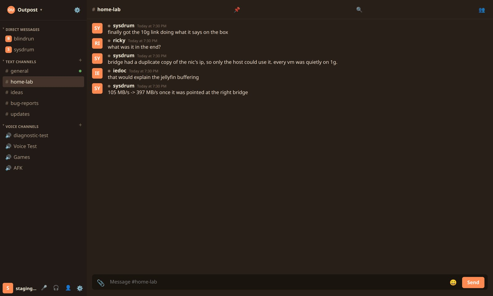
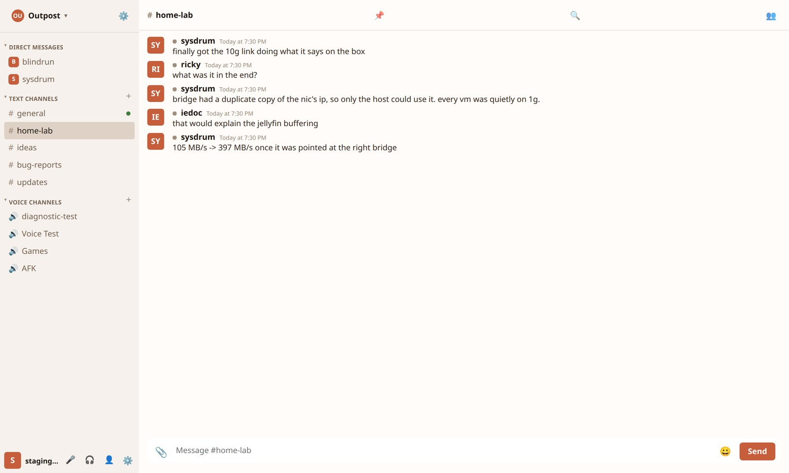
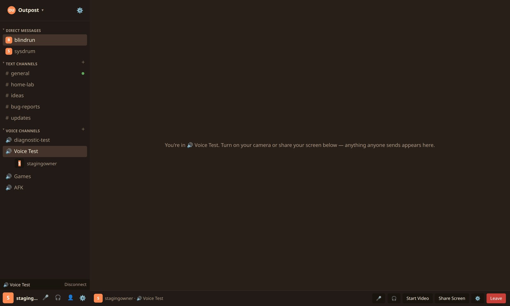
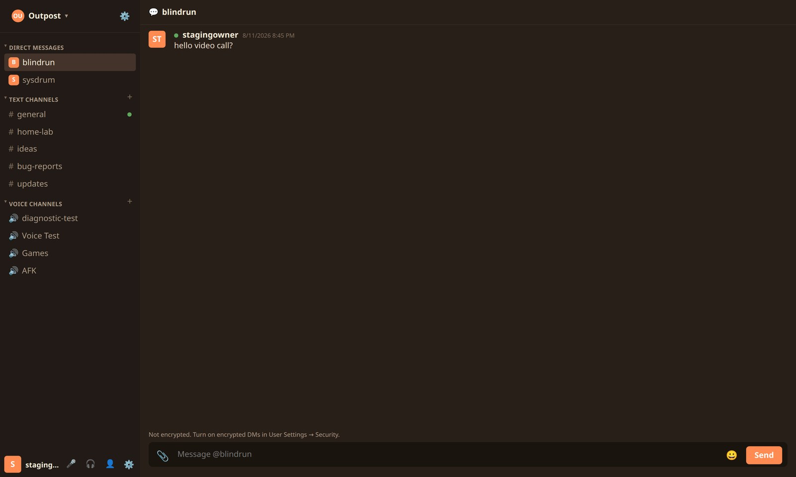
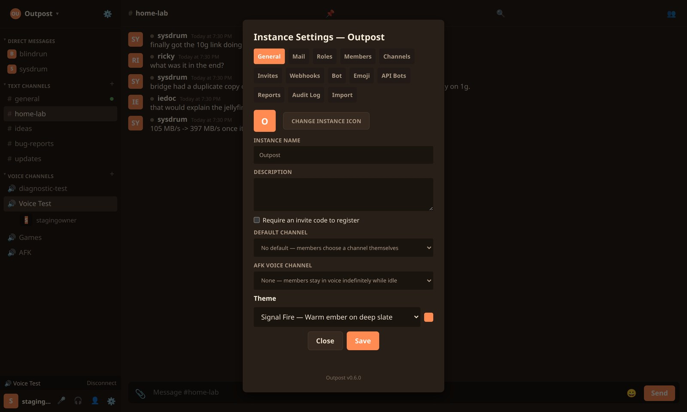
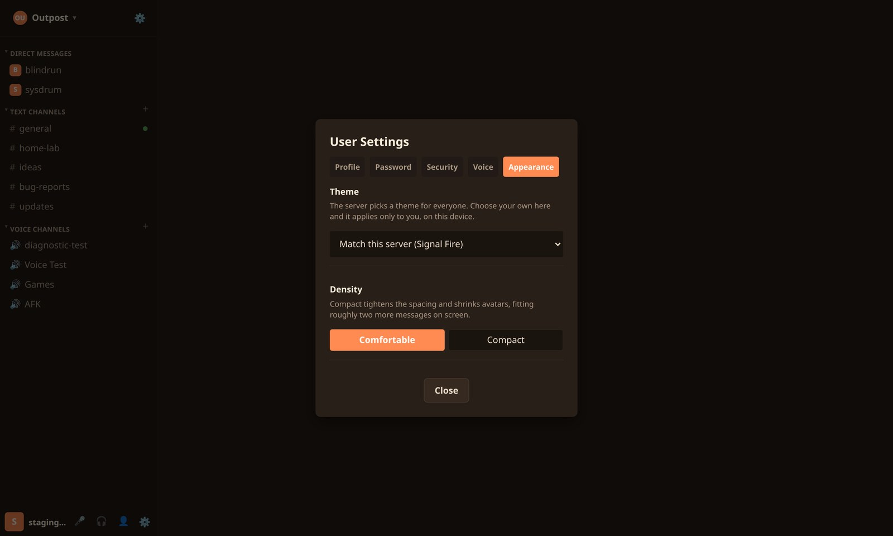

# Outpost

**[outpost-chat.com](https://outpost-chat.com)** — project site, server directory, downloads, changelog.

A self-hosted Discord alternative. Each Outpost deployment is one
self-hosted community — accounts, text/voice channels, roles, invites, file
uploads — reachable from a web browser or the native desktop app.

Built because no existing self-hosted platform (Matrix/Element, Revolt,
Mattermost, Rocket.Chat) covers the same combination of chat + real voice/
video in one place with this simple a deployment story. Assembled from
proven pieces rather than reinvented: [LiveKit](https://livekit.io) for
WebRTC voice/video, [MinIO](https://min.io) for file storage.

## Screenshots

Captured from the desktop app on Linux, v0.6.1.





Daylight, the first light theme. The server picks a default; each person can
override it for themselves in User Settings -> Appearance.



Join a voice channel and the call takes over the pane. Turn on a camera or
share a screen and they tile together.



Direct messages mark where encryption starts and stops. Dropping back to
plaintext reads as a warning, because that is what changes your exposure.



Your instance, your rules. Roles, invites, webhooks, reports, audit log.



Delete your own account whenever you want. The owner cannot, because an
instance with no owner cannot be administered.

## Features

- Accounts, channels (text + voice), roles/permissions, invite-gated or
  open registration
- Real-time chat: message edit/delete/reactions, typing indicators,
  presence, file attachments, custom emoji, threads, search and pinning
- Voice channels with push-to-talk or voice-activity detection, device
  selection, mute/deafen, camera video and screen sharing
- Direct messages and friends, with optional end-to-end encryption
- Moderation: reporting with a moderator queue, blocking, kick/ban, an
  audit log, and a bot/webhook API
- Two-factor auth (authenticator app or passkey), and optional single
  sign-on against any OpenID Connect provider
- Clients for web, desktop (Windows/macOS/Linux, with auto-update),
  Android and iOS
- Five built-in themes including a light one, an instance icon, and a
  description your instance can set for itself
- One instance = one community. The client (web or desktop) keeps a
  bookmark list of instance addresses instead of a single fixed server —
  add as many self-hosted instances as you want and switch between them

## Self-hosting

The whole backend (API + web client, Postgres, LiveKit, MinIO) runs via
Docker Compose:

```bash
git clone https://github.com/blindrun/outpost-chat.git
cd outpost-chat/deploy
./install.sh
```

See [`deploy/README.md`](deploy/README.md) for the manual install path,
updating, backups, and port requirements.

## Desktop client

Download the latest installer for Windows/macOS/Linux from the
[Releases page](https://github.com/blindrun/outpost-chat/releases). The
desktop app is just the web client packaged with Electron — on first
launch, use "Add a Server" to connect to your own (or anyone else's)
Outpost instance by address.

Installers are unsigned (no paid code-signing certificate for a personal
project), so Windows SmartScreen / macOS Gatekeeper will warn on first
run — that's expected, not a sign of a bad build.

**On macOS specifically**, an unsigned app often shows a scarier message
than a simple warning: *"Outpost is damaged and can't be opened. You
should move it to the Trash."* This is Gatekeeper's quarantine check
misreporting an unsigned app as corrupted — the download isn't actually
damaged. Fix it from Terminal:

```bash
xattr -cr /Applications/Outpost.app
```

(adjust the path if you didn't install to `/Applications`), then open it
normally.

The app checks for updates on launch and installs new ones automatically
(via [`electron-updater`](https://www.electron.build/auto-update) against
this repo's Releases). On Windows and Linux this works the same as any
other install; on macOS, automatic updates need a code-signed build to
apply — without one, an update can be detected but not installed
automatically, so a new version there still means downloading the
installer again from the Releases page.

## Building from source

```
├── src/            backend (Fastify + Prisma + Postgres)
├── web/             web client (React + Vite)
├── electron/         desktop client wrapper (Electron)
├── deploy/           self-host Docker Compose bundle
└── Dockerfile        production image (backend serves the built web client)
```

Backend:

```bash
npm install
docker compose up -d   # Postgres, LiveKit (--dev mode), MinIO
cp .env.example .env
npx prisma migrate dev
npm run dev
```

Web client (separate terminal):

```bash
cd web
npm install
npm run dev
```

Desktop client:

```bash
cd electron
npm install
npm run dev    # builds the web client for Electron, then launches it
npm run dist   # produces an installer for your current platform
```

## Changelog

See [CHANGELOG.md](CHANGELOG.md) for release notes.

## License

MIT — see [LICENSE](LICENSE).
